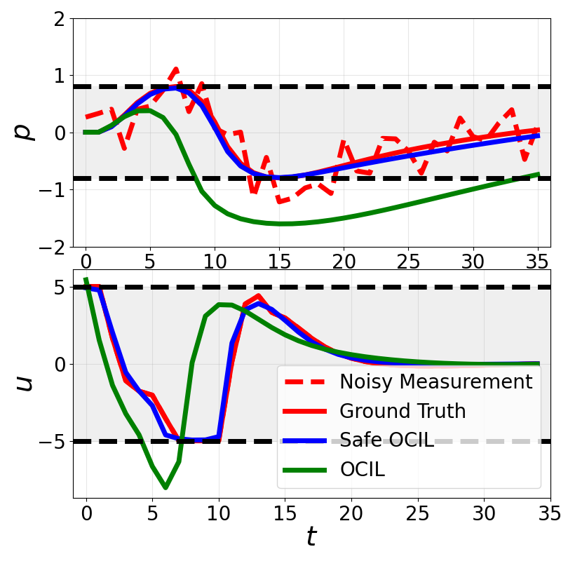
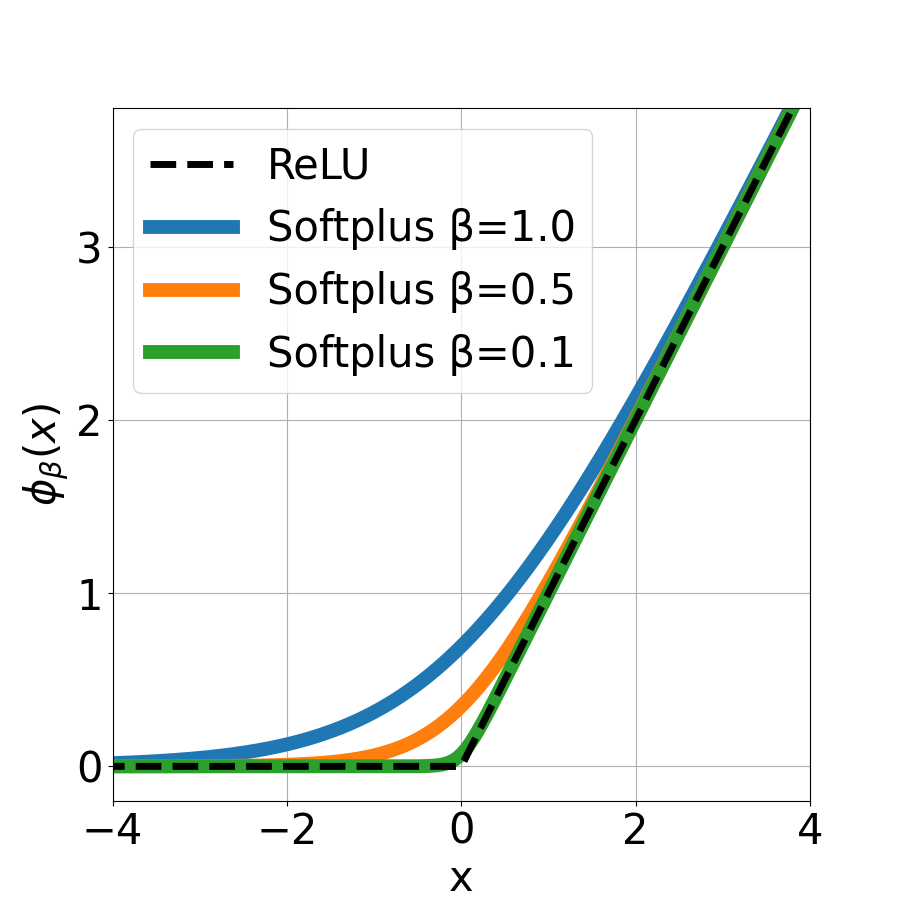
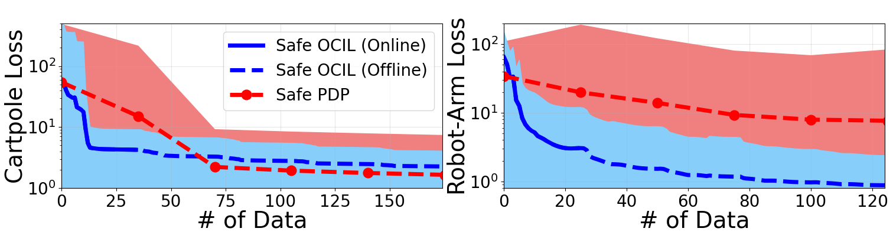
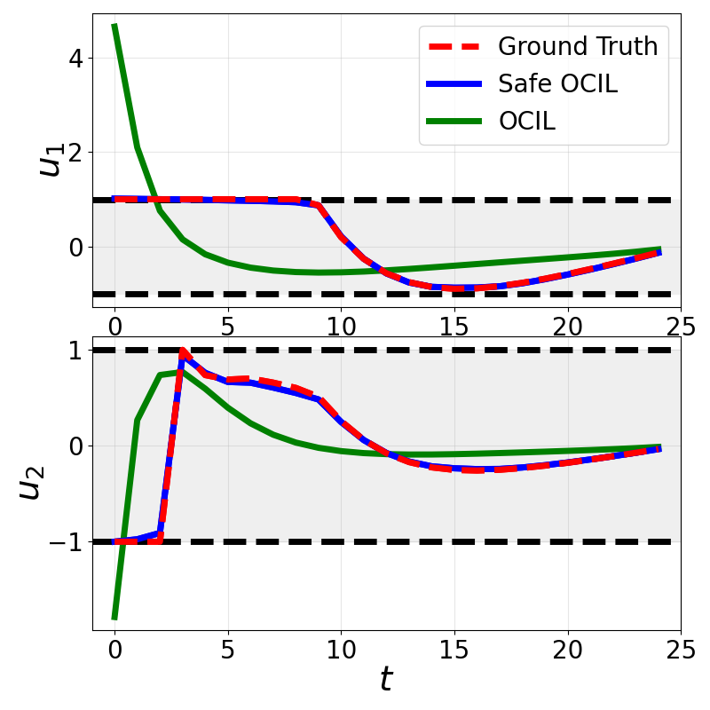

<div align="center">

# Safe Online Control-Informed Learning

**Tianyu Zhou · Zihao Liang · Zehui Lu · Shaoshuai Mou**
Purdue University

IEEE Control Systems Letters, vol. 9, pp. 3083–3088, 2025

[**Paper**](https://ieeexplore.ieee.org/document/11315148) ·
[**Project page**](https://zihaoliang.github.io/Safe-OCIL/) ·
[**Code**](https://github.com/ZihaoLiang/Safe-OCIL)

[](https://doi.org/10.1109/LCSYS.2025.3648637)
[](https://arxiv.org/abs/2512.13868)
[](https://zihaoliang.github.io/Safe-OCIL/)
[](LICENSE)



</div>

A robot is treated as a **tunable optimal control system**: its dynamics, its
objective function, and the **safety limits it must respect** are all parameters
we do not know. Safe OCIL learns them from a stream of measurements, one at a
time, and never proposes a trajectory that leaves the safe set on the way.

Three parts do the work. Each hard constraint is folded into the objective
through a **softplus barrier**, which is finite everywhere — so even a starting
guess that is itself unsafe still yields a usable trajectory and a usable
gradient. A **gradient generator** then obtains the exact derivative of that
trajectory with respect to the parameters, by differentiating through
Pontryagin's conditions for the relaxed problem. An **online parameter
estimator** based on the extended Kalman filter corrects the parameters as each
measurement arrives.

There are no epochs, no replay buffer and no batch to wait for. The paper proves
local convergence of the estimate together with satisfaction of the original
constraints, and an update finishes in well under one control period on both
systems.

> **[Try the interactive project page →](https://zihaoliang.github.io/Safe-OCIL/)**
> Scrub through learning one measurement at a time, watch both mechanisms move,
> and see every figure below drawn from the runs in this repository.

## The barrier

<div align="center">

</div>

Every path inequality `g(x, u, θ) ≤ 0` is replaced in the objective by

```
(1/α) · φ_β(g)        where   φ_β(x) = β · ln(1 + exp(x/β))
```

`β` controls how sharply the penalty turns on — as it shrinks, the curve folds
onto the hinge `max(0, g)` and the relaxed problem approaches the constrained
one. `1/α` controls how heavily a violation is charged against the control cost.
Unlike a logarithmic barrier, which is infinite outside the safe set, the
softplus is finite there, so the method does not need a feasible initial guess
to get started.

## What is learned

One update rule moves all three groups at once. Both example systems run in mode
`"All"`.

| Group | Cart-pole | Robot arm |
|---|---|---|
| **Dynamics** | cart mass, pole mass, pole length | link lengths `l1`, `l2` and masses `m1`, `m2` |
| **Cost weights** | `wx`, `wq`, `wdx`, `wdq` | `wq1`, `wq2`, `wdq1`, `wdq2` |
| **Safety limits** | force limit `max_u`, cart travel limit `max_x` | torque limit `max_u`, joint angle limit `max_q` |
| Total | 9 parameters | 10 parameters |

The safety limits are estimated, not given. Learning from a clean demonstration
the cart-pole settles on 4.97 against a true 5 and 0.77 against a true 0.8 —
just inside the true set, so nothing crosses it.

## Installation

Everything the examples need is in `src/`; there is no submodule to initialise.

```bash
git clone https://github.com/ZihaoLiang/Safe-OCIL.git
cd Safe-OCIL
conda create -n safeocil python=3.12
conda activate safeocil
pip install numpy scipy matplotlib casadi
```

Those four packages are all the examples need. Verified on Python 3.10 with
NumPy 1.26, SciPy 1.15, Matplotlib 3.10 and CasADi 3.7, and on Python 3.12 with
CasADi 3.6.5. **Python 3.12 or newer is required for the `plot.py` scripts**,
which use nested same-quote f-strings; the learning scripts themselves run on
3.10.

## Quick start

**Run every script from the repository root.** Each one builds its import path
and its data path from the working directory, so launching from inside an
example folder will not find `src/`.

```bash
python examples/cartpole/cartpole_SOCIL.py
```

This consumes a 35-step demonstration one measurement at a time, recovering all
nine parameters from a guess perturbed by ±0.1. The loss falls from 28.3 to 5.99
over the single pass, and every trajectory along the way respects the cart's
±0.8 m travel limit and the ±5 N force limit.

## Examples

Each script sets up a system, loads a demonstration, initialises the filter and
calls `solve()`. The covariances `P`, `Q` and `R` at the top of a script control
how aggressively the estimate moves; `alpha` and `beta` set the barrier.

| | Cart-pole | Robot arm |
|---|---|---|
| **Safe OCIL** — the method | `cartpole_SOCIL.py` | `robotarm_SOCIL.py` |
| 100 random initialisations | `cartpole_SOCIL_multi.py` | `robotarm_SOCIL_multi.py` |
| **OCIL** — no constraints, the ablation | `cartpole_OCIL.py` | `robotarm_OCIL.py` |
| 100 random initialisations | `cartpole_OCIL_multi.py` | `robotarm_OCIL_multi.py` |
| **Equality-constrained LQR** variant | `cartpole_EQLQR.py` | `robotarm_EQLQR.py` |
| 100 random initialisations | `cartpole_EQLQR_multi.py` | `robotarm_EQLQR_multi.py` |
| **Safe PDP** — the baseline | `cartpole_SPDP_multi.py` | `robotarm_SPDP_multi.py` |
| Regenerate the demonstration | `generateDemo.py` | `generateDemo.py` |
| Draw the paper figures | `plot.py` | `plot.py` |

Scripts live under `examples/cartpole/` and `examples/robotarm/`. The `_multi`
variants sweep 100 random initial guesses and write one `.mat` per trial into
`data/results/`; set `saveFlag = True` first.

The cart-pole folder carries two extra analysis scripts: `violations.py` counts
how far each method leaves the safe set, and `compare_parameter.py` /
`compare_parameter_loss.py` compare the recovered parameters.

### Barrier settings used in the paper

| System | `alpha` | `beta` | Horizon | `dt` |
|---|---|---|---|---|
| Cart-pole | 0.3 | 0.075 | 35 | 0.1 s |
| Robot arm | 0.08 | 0.02 | 25 | 0.2 s |

## How the code is organised

```
src/
  SafeOCIL.py         the method: barrier-relaxed optimal control, the auxiliary
                      system for the gradient, and the EKF update
  SafeOCIL_EQLQR.py   the same loop with the equality-constrained LQR gradient
  OCIL.py             the unconstrained ablation
  ocSolver.py         optimal control solver, PMP differentiation,
                      convert2BarrierOC and the EQCLQR solver
  ocSolverWithClip.py the same solver with exp(g/beta) clipped, so a badly
                      infeasible guess cannot overflow the barrier
  SafePDP.py          Safe Pontryagin Differentiable Programming, the baseline
  PDP.py              Pontryagin Differentiable Programming
  JinEnv.py           pendulum, cart-pole, robot arm, quadrotor and rocket,
                      each with initDyn / initCost / initConstraints
  EKF.py              the filter's predict and update steps
  Loss_function.py    the imitation loss
  generateTraj.py     produces a demonstration from known parameters
  softplus.py         draws the barrier figure above
examples/
  cartpole/  robotarm/  the scripts above, their demonstrations and results
  tests/                a cart-pole script running the same problem through
                        several solvers side by side
docs/                   the project page, served by GitHub Pages; one
                        self-contained HTML file, no build step, no dependencies
images/                 the figures in this README
```

Each incoming data point runs the same five steps. Solve the barrier-relaxed
optimal control problem with the current parameters. Build the auxiliary control
system and solve it for the derivative of the whole trajectory with respect to
those parameters. Take the residual between the prediction at one time index and
the observation. Chain the two together into the filter's measurement matrix.
Correct the parameters.

## Demonstration data

Each example folder holds four `.mat` files:

| File | What it is |
|---|---|
| `*_original_constrained.mat` | the demonstration, from the **hard**-constrained optimal control problem |
| `*_soft_constrained.mat` | the same problem solved with the softplus relaxation |
| `*_OCIL_original_constrained.mat` | the same demonstration with the two safety parameters removed, for the unconstrained ablation |
| `*_OCIL_soft_constrained.mat` | likewise for the relaxed problem |

The demonstration is generated from the hard-constrained problem while the
learner only ever solves the relaxed one, so the runs also measure what the
relaxation costs.

## Results

<div align="center">

</div>

Imitation loss against the number of data points consumed, over 100 random
initialisations, mean with a ±3σ band. Safe PDP updates once per full pass over
the demonstration; Safe OCIL corrects after every measurement, so it reaches a
low loss within the first pass.

<div align="center">

</div>

### Constraint violations

Measured on the trajectory each method reproduces after the last update. The
worst excursion is given as a fraction of the limit.

| System | Method | Signal | Steps outside | Worst excursion |
|---|---|---|---|---|
| Cart-pole | Safe OCIL | force `u` | 0.0 % | — |
| | | position `p` | 0.0 % | — |
| | OCIL | force `u` | 14.3 % | +81.0 % |
| | | position `p` | 77.1 % | +135.9 % |
| Robot arm | Safe OCIL | torque `u1` | 12.0 % | +1.3 % |
| | | torque `u2` | 0.0 % | — |
| | OCIL | torque `u1` | 8.0 % | +365.2 % |
| | | torque `u2` | 4.0 % | +78.5 % |

The robot-arm row is worth reading carefully. Learning from noisy measurements
(σ = 0.1), Safe OCIL estimates the torque limit as 1.07 rather than 1.0, and its
trajectory respects **that** limit — so it crosses the true one, but only by as
much as the estimate itself is loose. OCIL, which has no limit to estimate,
overshoots by a factor of four.

### Timing

Wall-clock time per update, averaged over every measurement of all 100 saved
trials in `data/results/SOCIL/`.

| System | Control period | Gradient generator | Filter update | Complete update | Share of the period |
|---|---|---|---|---|---|
| Cart-pole | 100 ms | 6.06 ± 0.32 ms | 0.77 ± 0.07 ms | 23.55 ± 15.24 ms | 24 % |
| Robot arm | 200 ms | 4.87 ± 0.26 ms | 0.68 ± 0.05 ms | 17.84 ± 3.46 ms | 9 % |

The balance of the complete update — about 17 ms on the cart-pole — is the
barrier-relaxed optimal control solve itself. The filter is almost free; the
trajectory and its derivative are what cost.

## Reproducing the figures

```bash
python examples/cartpole/plot.py     # both systems; needs Python 3.12+
python examples/cartpole/violations.py
```

Two caveats. `plot.py` also reads `data/results/OCIL/` and
`data/results/EQLQR/`, which are **not in the repository** — regenerate them with
the `_multi` scripts and `saveFlag = True` before running it. And `violations.py`
increments `OCIL_control_violations` inside the Safe OCIL loop, which raises a
`NameError` if Safe OCIL ever exceeds the force limit; it does not on the saved
cart-pole run, so the script completes as shipped.

What the repository does carry: 100 trials each of Safe OCIL and Safe PDP on both
systems, plus a cart-pole sweep over measurement noise (`SOCIL_noise2/4/08/10`,
σ = 0.2 to 1.0).

The remaining cart-pole result folders are named for the **spread of the initial
guess**, not for a barrier or learning-rate setting: `SOCIL_005` is Safe OCIL from
guesses perturbed by ±0.05 rather than the ±0.1 of `SOCIL`, and `SPDP_005` is Safe
PDP from ±0.05 rather than the ±0.025 of `SPDP`. `SOCIL_01` and `SPDP_0025` are
byte-for-byte copies of `SOCIL` and `SPDP` respectively — the same runs re-filed
under their own spread. Note that the headline comparison therefore draws Safe
OCIL's initial guesses from a spread four times wider than Safe PDP's; the two
`_005` folders are the matched pair, and Safe OCIL still reaches a lower loss
there from less data.

## Notes

- **The plots block.** `solve()` can end with a blocking Matplotlib window. For
  unattended runs set a non-interactive backend: `MPLBACKEND=Agg python ...`

- **Cost weights are identifiable only up to scale.** Multiplying every weight in
  the objective by the same constant leaves the optimal trajectory unchanged, so
  the parameter error can look large while the trajectory matches the
  demonstration exactly. Judge results by the trajectory loss, and compare cost
  weights by their ratios.

- **The safety limits are learned too**, so the guarantee is that the trajectory
  stays inside the *estimated* safe set. How close that is to the true one
  depends on how much the measurements pin the limits down — see the robot-arm
  row above.

- **`α` and `β` trade safety against conditioning.** Smaller values push the
  relaxed solution closer to the hard-constrained one, but sharpen the objective
  and make the optimal control solve harder. The paper's values are in the table
  above.

- **Cost per data point is high.** Every update re-solves the full relaxed
  optimal control problem and the full auxiliary system, then uses one time index
  of the result. That is what buys an exact gradient rather than an approximate
  one.

## Citation

```bibtex
@article{zhou2025safe,
  title   = {Safe Online Control-Informed Learning},
  author  = {Zhou, Tianyu and Liang, Zihao and Lu, Zehui and Mou, Shaoshuai},
  journal = {IEEE Control Systems Letters},
  volume  = {9},
  pages   = {3083--3088},
  year    = {2025},
  doi     = {10.1109/LCSYS.2025.3648637}
}
```

Safe OCIL builds on Online Control-Informed Learning:

```bibtex
@article{liang2025online,
  title   = {Online Control-Informed Learning},
  author  = {Liang, Zihao and Zhou, Tianyu and Lu, Zehui and Mou, Shaoshuai},
  journal = {Transactions on Machine Learning Research},
  issn    = {2835-8856},
  year    = {2025},
  url     = {https://openreview.net/forum?id=LDzvZEVl5H}
}
```

## Acknowledgements

The optimal control solver, the auxiliary control system used to generate
gradients, the constrained variants, and the simulated environments come from
[Pontryagin Differentiable Programming](https://github.com/wanxinjin/Pontryagin-Differentiable-Programming)
and [Safe PDP](https://github.com/wanxinjin/Safe-PDP) by Wanxin Jin and
colleagues.

## License

MIT. See [LICENSE](LICENSE).
